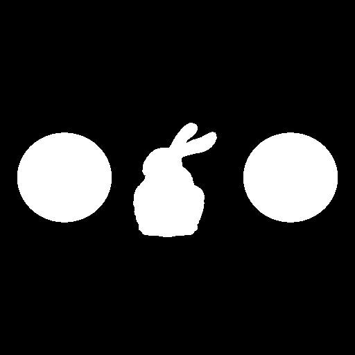
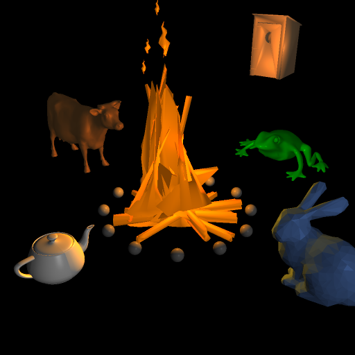

# raylang-rust

Simple raytracer for exploring programming languages.  Rust edition.

Based on [David Breen][david]'s [CS636 Class][cs636] assignments and my own
previous Haskell implementation [cs636-raytracer][cs636-raytracer].

[cs636-raytracer]: https://github.com/tchagnon/cs636-raytracer
[david]: https://www.cs.drexel.edu/~deb39/
[cs636]: https://www.cs.drexel.edu/~deb39/Classes/CS431/index_Spring09.html

## Why?

For fun.  To learn new languages, and how usable they are for a heavily
computational program.  Rust in this case.

# Running Examples

To run the examples, you need some `.smf` model files in the `models/`
directory.  The example model files are originally from
https://www.cs.drexel.edu/~deb39/Classes/CS586/Models/

Use the following command to download them all:

```
wget -r -np -nd -A smf https://www.cs.drexel.edu/~deb39/Classes/CS586/Models/
```

## Building and Running

```
cargo build --release
cargo run scenes/scene0.json --release
```

Running without `--release` will take significantly longer due to the lack of
optimization.

Output image will be written to the file specified in the `scene0.json` file.

```
Wrote file "scene0.png"
```



As of 0.2.0, scenes can also be written in Python by constructing a data
structure similar to the json input and passing it to a `render` function.  This
uses the scene data structure, ray tracer C library, and Python utility
functions as a small embedded domain-specific language (EDSL) and has the
advantage of being able to generate parts of the scene programmatically.

```
python scenes/scene1.py
```



## Versions and Status

Tagged versions correspond to assignments. For example, 0.1.0 implements the
requirements for assignment 1.  `master` may contain a partially completed next
version at any time.

The current version is: `0.3.0`
